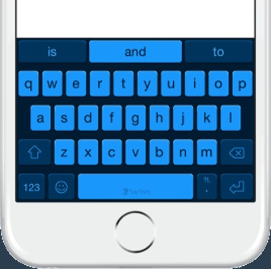
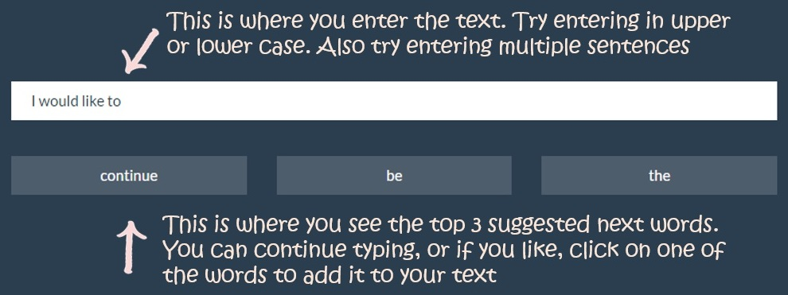

========================================================
transition: rotate
transition-speed: slow
font-family: 'Cambria'

Introduction
========================================================
While the number of mobile devices have grown exponentially over the years, one challenge users have felt is the inability to type with the same deftness as one would on a full computer keyboard. One way to simplify the typing experience is to provide users an alternative to typing whole words. SwiftKey has developed a solution where a software learns the typing patterns of a particular user, and along with a knowledge of the language, it is able to suggest the top 3 most probably next words that the user wants to type.

This assignment is a subset of that technology, where the prediction software is trained just on a large corpus of text in English. Data has been provided by SwiftKey from blogs, news and twitter feeds. Using the principles from Natural Language Processing, an n-gram model is created and trained on this corpus. The final prediction table is then paired down to reduce the amount of memory consumed by the application. But this reduces the prediction accuracy as well. Finally, this reduced prediction table is used in a Shiny app to provide users an interface to type in a string and have the system predict the next word.

Algorithm - Building the model
========================================================
1. The first task was to separate the text based on individual sentences. Sentences are separated from each other not only by the period, but also by colons, semicolons and quotes. Interestingly, this logic also removes the apostrophes in some words. These have to be added back in, in the final prediction algorithm. Numbers, extra spaces, special symbols and other punctuation marks are removed and the text was converted to a lower case. The expletives were also removed from the text. This gives us the cleaned data.
2. Using the RWeka and TDM packages, the corpus was converted into a TermDocumentMatrix, and then into a simple matrix with 2 columns - nGrams and their count in the corpus. This analysis has considered 2- through 5-grams only.
3. The nGram column is then split. The last word of the nGram is taken out of the nGram column and stored in a new column called NextWord. Now the nGram column has 1 to 4 words.
4. Since the final product will be used only to predict the top 3 words, the subsequent words are deleted from the matrix. Important: The last step dramatically reduces the size of the nGram database so that it can be used in a Shiny app. However, this also reduces it's accuracy.
 
<table>
	<tr>
		<td>&nbsp;</td>
		<td align="right" colspan=3><b>Original nGram data</b></td>
		<td colspan="3"><b>After removing > 3 suggestions</b></td>
	</tr><tr>
		<td><b>nGram</b></td>
		<td><b>Unique nGrams</b></td>
		<td><b>Total nGrams</b></td>
		<td><b>File size</b></td>
		<td><b>Unique nGrams</b></td>
		<td><b>Total nGrams</b></td>
		<td><b>File size</b></td>
	</tr><tr>
		<td><b>2</b></td>
		<td >47,762</td>
		<td>286,758,074</td>
		<td>16.8 MB</td>
		<td>47,762</td>
		<td>87,907,099 (31%)</td>
		<td>2.2 MB (13%)</td>
	</tr><tr>
		<td><b>3</b></td>
		<td>244,042</td>
		<td>128,125,547</td>
		<td>19.4 MB</td>
		<td>244,042</td>
		<td>67,753,392 (53%)</td>
		<td>9.4 MB (49%)</td>
	</tr><tr>
		<td><b>4</b></td>
		<td>462,563</td>
		<td>46,030,908</td>
		<td>23.1 MB</td>
		<td>462,563</td>
		<td>33,534,372 (73%)</td>
		<td>17.7 MB (77%)</td>
	</tr><tr>
		<td><b>5</b></td>
		<td>635,763</td>
		<td>16,451,820</td>
		<td>26.9 MB</td>
		<td>635,763</td>
		<td>  13,592,426 (83%)</td>
		<td>24.7 MB (92%)</td>
	</tr><tr>
		<td><b>Total</b></td>
		<td><b>1,390,130</b></td>
		<td><b>477,366,349</b></td>
		<td><b>86.4 MB</b></td>
		<td><b>1,390,130</b></td>
		<td><b>202,787,289</b> (42%)</td>
		<td><b>54.0 MB</b> 63(%)</td>
	</tr>
</table>

How to use the application
========================================================
The application is built using a simple and intuitive user interface. There is a text box where the user can enter the text. Based on what the user enters, there are 3 buttons that suggest what the next word could be. This is retrieved from the nGram table described in the previous The user can continue to type, and the suggestions will keep changing based on what has been entered. The user could also click on the word and that will be added to the text.
 
<a href='https://shamikmitra.shinyapps.io/PredictNextWord/'  target='_blank'>Click here</a> to open the application. <a href='https://github.com/shamikmitra/Capstone'  target='_blank'>Click here</a> for the source code.
Future improvements
========================================================
This model is far from being a perfect model. Here are some of the ways it can be improved  

1. The model only assumes simple nGrams. However, depending on the subject of a sentence, the prediction can be greatly improved. During the initial parsing of the nGrams, the subject of each of the sentences can be derived, and then added as an additional dimension in the final nGram table.
2. The model suffers from the problems of spelling errors. Prior to building the model, a spell check would improve the model.
3. This model behaves poorly for proper nouns that mean differently when they are not a noun. The model can seperate the nouns from common phrases - like differentiating between 'US' and 'us'.
4. The model can also be made self learning. As the user keeps using the software, it could learn the specific sequence of words being typed, and keep updating the nGram table after certain patterns are typed more than a minimum threshold.

 

The author would like to thank 
a. The teachers and staff at Johns Hopkins University for making this wonderful course available to us; 
b. The teachers and staff at Stanford University their very informative course on Natural Language processing; 
c. SwiftKey for providing the corpus used in the analysis; and 
d. StackOverflow experts who have provided answers to challenging questions including the hairy issues of memory management.

